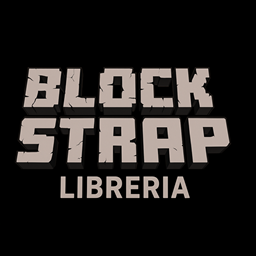

  

<h1 align="center"> DOCUMENTACION - blockStrap-libreria </h1>

DOCUMENTACION - BlockStrap

## Tabla de contenido 
- [Descripcion General](#descripcion-general)
  * [Nombre de la libreria](#nombre-de-la-libreria)
  * [Indicaciones Generales](#indicaciones-generales)
  * [Pre-Requisitos](#pre-requisitos)
  * [Versión](#version)
- [Procesos](#procesos)
   * [Construido con](#construido-con)
   * [Herramientas Utilizadas](#herramientas-utilizadas)
- [Desarrolladores](#desarrolladores)
 
  
## Descripcion General
Sumérgete en el fascinante mundo de bloques de Minecraft con nuestra librería de HTML y CSS. 
                Inspirada en la estética única y pixelada de este icónico juego, nuestra librería ofrece 
                elementos cuidadosamente diseñados que te transportarán al mundo cúbico de Minecraft.

### Nombre de la Librería
BlockStrap - Libreria

### Indicaciones Generales

Estas instrucciones te permitirán obtener una copia del proyecto en funcionamiento en tu máquina local para propósitos de desarrollo y pruebas.

* Dirigirse al entorno de desarrollo en este caso (VISUAL STUDIO).
* Crear una carpeta de manera local en el directorio de tu computadora.
* Estando en la carpeta, abrir la consola con Crtl + ñ y agregar el siguiente comando "npm i npm-blockstrap-libreria"
* Le damos aceptar y ya tendriamos el repositorio en nuestro ordenador

### Pre-Requisitos 

Necesitas tener instalado en tu maquina los siguientes componentes:

* Un editor de texto
* Node.js para compilar codigo en SASS.
* Instalacion previa de SASS.

### Versión 
* Versión 1.0.1
## Procesos
### Construido con

- Marcado semántico HTML5
- Propiedades personalizadas de CSS
- Flex box
- Css Grid
- Diseño responsivo
- Sass
- Git

### Herramientas utilizadas

- [VSCode](https://code.visualstudio.com/)
- [Sass](https://sass-lang.com/)
- [Git](https://git-scm.com/)
- [GitHub](https://github.com/)
  
## Desarrolladores

- Emily Azucena Velásquez Flores - VF22006 - [Emily Velasquez](https://github.com/EmilyVelasquez2204)
- Nestor Emmanuel Mendoza Benitez - MB21010 - [Nestor Mendoza](https://github.com/blackghossst)
- Dayna Rebeca Moreno Santiago - MS21017 - [Dayna Moreno](https://github.com/Rebecamo)
- Madelyn Johana Martinez Romero - MR20119 - [Madelyn Romero](https://github.com/Mady06-es)
